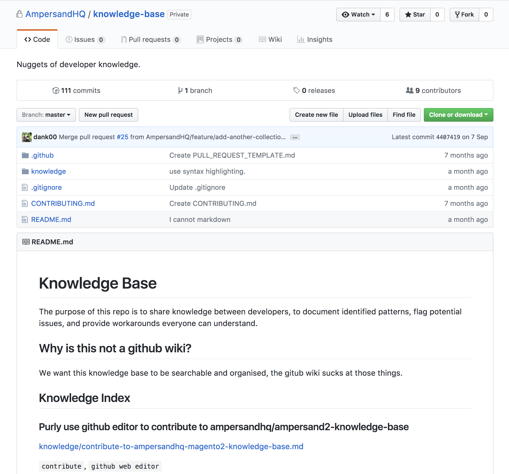
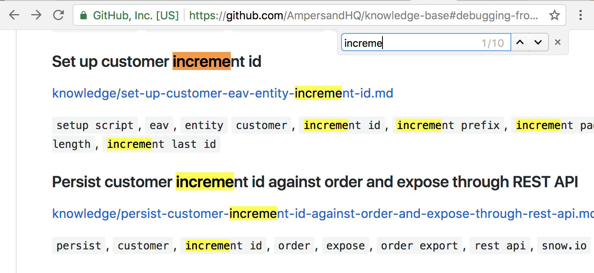
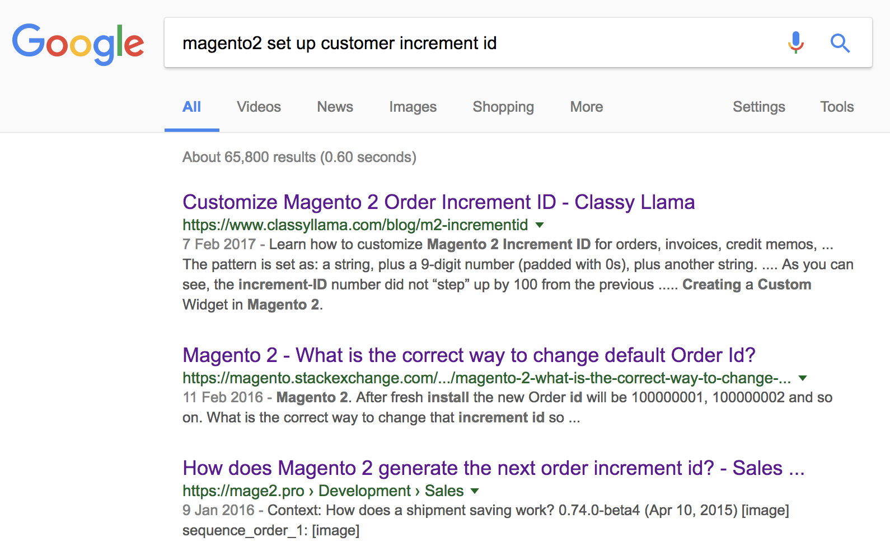

@title[Introduction]
## Knowledge Base
##### <span style="font-family:Helvetica Neue; font-weight:bold">Your <span style="color:#e49436">source code</span> matters!</span>

---

@title[Too long; don't read]

## TL;DR

<span style="font-size:0.6em; color:gray">Knowledge is worth <span style="color:#e49436">sharing</span>.</span> |
<span style="font-size:0.6em; color:gray"><span style="color:#e49436">Source code</span> is a part of knowledge.</span>

##### This DevX is about encouragement

---

### Facts - a silly statistics

<ul>

<li>It is created in <span style="color:#e49436">March 2017</span> - Half a year ago</li>

<li class="fragment"><span style="color:#e49436">23 contributions</span> in total</li>

<li class="fragment"><span style="color:#e49436">9</span> out of 42 Github members have contributed</li>

</ul>

+++

### Not bad

##### There must be <span style="color:#e49436">something more</span> to share

##### It could be <span style="color:#e49436">more</span> popular

Note:
Why? Maybe we just don't know exactly how **low** the threshold is.

---

##### So, what is a <span style="color:#e49436">knowledge base</span>?

+++



+++

##### Yes, I know, it is a <span style="color:#e49436">repo</span>.

##### I meant... what <span style="color:#e49436">exactly</span> does it offer?

+++

### Problems - the patterns

<ul>

<li><span style="color:#e49436">DevOps</span> have patterns.</li>

<li class="fragment"><span style="color:#e49436">Requirements</span> have patterns.</li>

<li class="fragment"><span style="color:#e49436">Solutions</span> / implementations have patterns</li>

</ul>

Note:
- DevOps: Create Magento 2 module, integrate, and work in vendor dir

  [Create Magento 2 module, integrate, and work in vendor dir]
  
  [Debugging from the Command Line]

- Requirements: Set up a UK website and a Ireland website.

- Solutions: Actually set up magento 2 websites... How?

  [Set up customer increment id]

[Create Magento 2 module, integrate, and work in vendor dir]: https://github.com/AmpersandHQ/knowledge-base#create-magento-2-module-integrate-and-work-in-vendor-dir
[Debugging from the Command Line]: https://github.com/AmpersandHQ/knowledge-base#debugging-from-the-command-line
[Set up customer increment id]: https://github.com/AmpersandHQ/knowledge-base#set-up-customer-increment-id

+++

Because there are <span style="color:#e49436">patterns</span>, there is always something (aka <span style="color:#e49436">knowledge</span>) to <span style="color:#e49436">reuse</span>

---

### Requirements

<ul>

<li><span style="color:#e49436">Low overheads</span> on creation.</li>

<li class="fragment"><span style="color:#e49436">Low maintenance</span> cost</li>

<li class="fragment">Easy contributions</li>

<li class="fragment">Dev friendly. Something we are <span style="color:#e49436">familiar</span> with</li>

<li class="fragment">Encouragement.<br />Low threshold - so, <span style="color:#e49436">everyone</span> can do it</li>

</ul>

Note:
Be realistic. I have a ticket and estimation. I don't want to go behind schedule.

We don't want to maintain it at all (I don't)

So, we can grow knowledge

So we like it

So more people can help with it

It is <span style="color:#e49436">voluntary</span>, so we have these requirements

---

### Solution!

#### Knowledge Base

+++

It is a place to <span style="color:#e49436">share</span> knowledge</span>

+++

It inherits the benefits of being a Github repo, it is:

<ul>

<li class="fragment"><span style="color:#e49436">Dev friendly</span><br />
We all are familiar with github repo </span>

<li class="fragment"><span style="color:#e49436">Easy contributions</span><br />
You create a PR and you can get anyone to review and improve.</li>

</ul>

+++



- You look around, search for a <span style="color:#e49436">keyword<span>.

- If you found it, there's probably <span style="color:#e49436">something</span>

+++

##### What (usually) will you see in knowledge base?

- <span style="color:#e49436">Generalised guidelines</span> / tutorials

- <span style="color:#e49436">Code references</span>

+++

### Generalisation is awesome

It is <span style="color:#e49436">attractive</span> to audiences.

<span class="fragment">But... it comes with a cost:</span>

<ul>

<li class="fragment"><span style="color:#e49436">Overhead</span> on creation </li>

<li class="fragment"><span style="color:#e49436">Maintenance</span> cost </li>

</ul>

Note:
Think of an <span style="color:#e49436">generalised example</span>.
Think of the **audiences**. Workflow? Background knowledge?
Do I have **references** to support my opinions?.
Best practice may no longer the best. Topic explanation may no longer valid.

+++

### Code reference is (maybe) <span style="color:#e49436">less attractive</span>
 
But it is:

<ul>

<li><span style="color:#e49436">Low overhead</span> on creation </li>

<li class="fragment"><span style="color:#e49436">Nearly no</span> maintenance cost </li>

<li class="fragment">Encouragement - no specific techniques beside being a developer, are needed</li>

</ul>

Note:
You don't think of <span style="color:#e49436">audience</span>. You are the only audience.
You don't need **reference**.
Remember, when you commit a code, it is <span style="color:#e49436">frozen</span> at that state. It <span style="color:#e49436">works<span> at that state forever.

+++

### Generalised Guidelines vs Code References

<table>
  <tr>
    <th></th>
    <th>Overhead on creation</th> 
    <th>Maintenance</th>
  </tr>
  <tr>
    <td>Generalised Guidelines</td>
    <td>High</td>
    <td>High</td>
  </tr>
  <tr>
    <td>Code References</td>
    <td><span style="color:#e49436">Low</span></td>
    <td><span style="color:#e49436">Low or none</span></td>
  </tr>
</table>

+++

### Code reference is...

<ul>

<li>Actually a <span style="color:#e49436">“real”</span> example and use case</li>
<li class="fragment">People <span style="color:#e49436">like</span> code example (well.. at least apply to me).</li>

</ul>

<span class="fragment">##### Generalised guidelines are <span style="color:#e49436">more than welcome!</span></span>

---

### So, how to <span style="color:#e49436">contribute</span> (code reference)?

<span class="fragment">It is all about <span style="color:#e49436">PR</span> and <span style="color:#e49436">commit(s)</span>.</span>

+++

## <span style="color:#e49436">PR</span> is Use Case

<span style="font-size:0.6em; color:gray">It shows you <span style="color:#e49436">what</span> is it doing</span>

+++

## <span style="color:#e49436">Commit(s)</span> is Code Example

<span style="font-size:0.6em; color:gray">It shows you <span style="color:#e49436">how</span> to implement the use case</span>

+++

## So...

<span style="font-size:0.6em; color:gray">We have got all the <span style="color:#e49436">information</span> we need</span>

<span style="font-size:0.6em; color:gray">We just need to <span style="color:#e49436">spread it</span>!</span>

+++

## Well...

<span style="font-size:0.6em; color:gray">You have got to...</span>

<span style="font-size:0.6em; color:gray">Give some <span style="color:#e49436">love</span> to the <span style="color:#e49436">commits</span> and <span style="color:#e49436">PR<span></span>

+++

## You need to...

<ol>

<li><span style="color:#e49436">Have clear and brief</span> PR description</li>

<li class="fragment">Have <span style="color:#e49436">code comments</span><br />explaning a bit more details</li>

<li class="fragment"><span style="color:#e49436">Organise</span> commits better<br />(PS: ignore this if you are against rebase)</li>

</ol>

+++

PR description, code comments... well...

##### <span class="fragment">We <span style="color:#e49436">have got them already</span>. Right?</span>

---

## Let's feel about it

<span style="color:#e49436">Question</span>: Set up a customer increment id in Magento 2?

<span class="fragment"><span style="color:#e49436">How</span> will we usually do it?</span>

+++

##### 1. <span style="color:#e49436">Google</span>: "magento2 set up customer increment id"



+++

<iframe class="stretch" data-src="https://www.classyllama.com/blog/m2-incrementid"></iframe>

+++

### Oops...

<ul>

<li>The article is <span style="color:#e49436">too long</span> and deep... </li>

<li class="fragment">I don't want to know <span style="color:#e49436">how does it work</span>. I just want to <span style="color:#e49436">how to do it</li>

<li class="fragment">Online resources may <span style="color:#e49436">not always exactly fit</span> our use cases </li>

</ul>

+++

##### 2. <span style="color:#e49436">Ask</span> other developers

+++

##### 3. Look up <span style="color:#e49436">core code</span> to find similar reference

+++

### So, how much <span style="color:#e49436">time</span> cost is it?

<ol>
    
<li><span style="color:#e49436">Ask Google</span>

<ul>

<li class="fragment">If lucky, you will land on StackOverflow</li>

<li class="fragment">If it is not applicable, try different keywords again.</li>

</ul>
    
</li>

<li class="fragment"><span style="color:#e49436">Ask other developers</span></li>

<li class="fragment">Look up core code</li>

<ul>

<li class="fragment"><span style="color:#e49436">Analyse core code</span></li>

<li class="fragment">If lucky, got inline doc to explain the usages. <span class="fragment">(Well... rarely happen...)</span></li>

</ul>

</li>
  
</ol>

+++

### What if we have <span style="color:#e49436">indexed</span> a reference?


+++

```diff
/**
@@ -340,6 +347,27 @@ public function upgrade(Setup\ModuleDataSetupInterface $setup, Setup\ModuleConte
 // Enable incremental id of customer
 if (version_compare($context->getVersion(), '0.10.0', '<')) {
     $this->configWriter->save(\Magento\Customer\Model\Customer::XML_PATH_GENERATE_HUMAN_FRIENDLY_ID, 1);
+
+    /**
+     * Set up pattern: 62+000000
+     *
+     * The prefix 62 will always keep the same.
+     * After 62 + 6 9's (i.e, 62999999),
+     * the next number will be 621 + 6 0's (i.e., 621000000)
+     *
+     * If the prefix is 6 and form a pattern like 6+2000000
+     * After 62 + 6 9's (i.e, 62999999),
+     * the next number will be 63 + 6 0's (i.e., 63000000)
+     */
+    $customerType = $customerSetup->getEavConfig()->getEntityType('customer');
+    $eavStoreConfig = $this->eavStoreConfigFactory->create()->loadByEntityStore($customerType->getEntityTypeId(), 0);
+    $eavStoreConfig->setIncrementPrefix(62);
+    $eavStoreConfig->setIncrementLastId(0);
+    $customerType->setIncrementPadChar(0);
+    $customerType->setIncrementPadLength(6);
+    $customerType->save();
+    $eavStoreConfig->save();
+
 }
```

[Full example](https://github.com/AmpersandHQ/knowledge-base/blob/master/knowledge/set-up-customer-eav-entity-increment-id.md)

---

### What to share?

[RuleOfThree](http://wiki.c2.com/?RuleOfThree)? ... we don't actually need a strict rule

+++

### So, maybe... share everything?

+++

Remember, <span style="color:#e49436">the cost is not much</span> to index a code reference in knowledge base

+++

Why not do it <span style="color:#e49436">aggressively</span>?

---

### Okay, what <span style="color:#e49436">exactly</span> should I share?

+++

### Do share

<ul>
<li>If you <span style="color:#e49436">think</span> someone else may need it</li>
<li class="fragment">If it is your <span style="color:#e49436">second time</span> implementing a similar requirement</li>
<li class="fragment"><span style="color:#e49436">If you want!</span></li>
</ul>

+++

### Don't share

<ul>
<li class="fragment">If you can easily find <span style="color:#e49436">an alternative online</span> (e.g., stackoverflow)</li>
<li class="fragment">If you're sure it is <span style="color:#e49436">not a pattern</span> at all. Other projects or developers won't need it</li>
</ul>

---

### My last words...

<ul>

<li>If you really can't decide... <span class="fragment"><span style="color:#e49436">share it</span> as code reference!</span></li>

<li class="fragment">How much overhead is it? ...very low, <span style="color:#e49436">around 15 mins</span></li>

<li class="fragment">Do I need to keep it up to date? ...<span style="color:#e49436">not really</span></li>

</ul>

Note:
We **don't** expect to keep code reference <span style="color:#e49436">up to date</span>.
Once you committed the code, it lives forever (figuratively). As long as
<span style="color:#e49436">it works at the time you committed</span> it, it does not matter if we got a
<span style="color:#e49436">better way</span> to do it or the
<span style="color:#e49436">old way is not working anymore</span>. It is just a reference after all.

---

## Conclusion

1. <span style="color:#e49436">Use</span> the knowledge base

2. <span style="color:#e49436">Contribute</span> and grow it!
